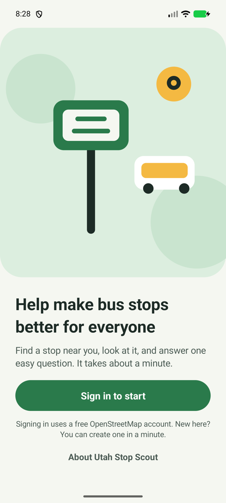

# Utah Stop Scout

**A little walk. A better map.**

Utah Stop Scout is a playful, beginner-friendly Android app for improving bus-stop information in Utah. Find a nearby stop, walk over, and answer simple questions about what you see. Your answers help improve [OpenStreetMap](https://www.openstreetmap.org), the free map used by many apps and websites.

You do not need mapping experience. You just need to be at the stop and look around.

  
  
  

Screenshots show the app with demo stops around downtown Salt Lake City. Names and distances illustrate the interface; they are not a live list of available surveys.

## Get the app

You need an Android phone running Android 8.0 or later and a free OpenStreetMap account. An internet connection is required to load stops and save answers.

This is an early version, with no downloadable release published yet. If you have an APK from the project maintainer, open it on your phone to install it; Android may ask you to allow installation from that source. Developers can [build and install the app](docs/developer-guide.md#build).

Saving may be unavailable while the campaign is being set up. If the app says saving is not switched on, your answers have not been saved.

## How to use it

1. **Sign in.** Tap **Sign in to start**. Your browser opens OpenStreetMap sign-in. You can create a free account there if you need one, then return to the app.
2. **Find a close stop.** Allow location access to see stops around you. In **List**, stops within 200 feet stand out in green; farther stops gradually fade into the background. Distances and direction arrows help you find your way. Use **Map** to see where the stops are.
3. **Walk to the stop.** Tap it in the list, or select its map pin and tap **Help with this stop**. Answer the questions based on what you can actually see. Choose **I can't tell** whenever you are unsure, or **Skip this stop** to choose another.
4. **Review and save.** Check your answers, change anything you need to, then tap **Yes, save my answers**. Answers you save become public OpenStreetMap edits, visible with your OpenStreetMap username.

If location is off or unavailable, the app shows stops around downtown Salt Lake City instead. It labels this fallback and does not highlight those stops as close to you. Tap the location prompt to enable location access.

## Learn more

Open **About** from the welcome screen or the top of the nearby-stops screen for the app version, credits, and project links.

Utah Stop Scout is open source under the [Apache License 2.0](LICENSE). The bus-stop campaign uses [MapRoulette](https://maproulette.org), and map data is © [OpenStreetMap contributors](https://www.openstreetmap.org/copyright).

For development, build setup, authentication, and campaign configuration, see the [developer guide](docs/developer-guide.md) and [developer pitfalls](docs/developer-pitfalls.md).
