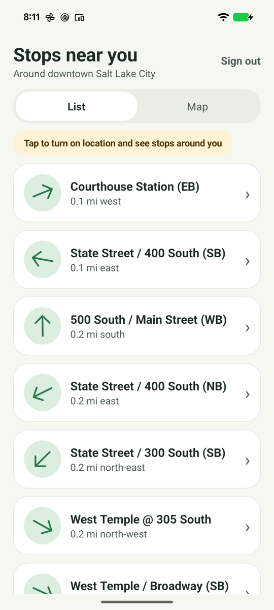
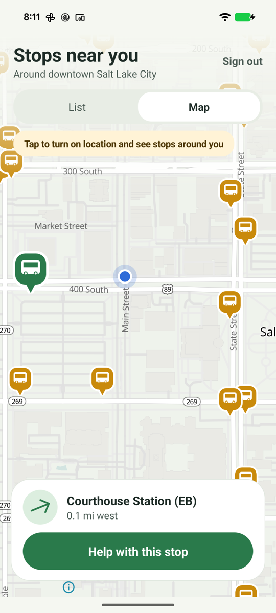

# Utah Stop Scout

A small, beginner-friendly Android app for the Utah bus-stop MapRoulette campaign, in the spirit of StreetComplete. Sign in, see the bus stops near you as a list or on a map (with distance and a compass arrow pointing the way), walk to one, and answer a plain-language question about it. Answers go onto OpenStreetMap, after a confirmation screen that says so.

<p>
  
  
</p>

The screenshots show the app's fallback view of downtown Salt Lake City, used when location is off.

This is a separate app repository and a MapRoulette Mobile SDK consumer. The SDK handles challenge/task reads, bearer credentials, live choice checks, and task submission. AppAuth handles the browser-based OSM sign-in flow. The app itself never stores an OSM API key or directly uploads an OSM changeset; the selected MapRoulette backend applies an accepted choice edit. The map is [MapLibre](https://maplibre.org/) with the [OpenFreeMap](https://openfreemap.org/) Positron style, tinted to the app's colors.

## Current campaign routing

- **Stage** (`https://mr-stage.osm.lol`): challenge 1, Salt Lake County; challenge 2, outside Salt Lake County.
- **Production** (`https://mr-prod.osm.lol`): the campaign is not imported yet. Its allowlist is intentionally empty. The app explains this state and does not search production challenges or show unrelated tasks.

Challenge IDs are backend-local. Update `Backend.kt` only after the production campaign is imported and its IDs are verified. A challenge ID is never accepted from free-form user input.

Both backend Write Policy switches currently start off. Stage and Production use separate MapRoulette data but both connect OSM edits to the live `openstreetmap.org` database. The app requires an explicit confirmation screen that lists the chosen answers and says the edit is public on OpenStreetMap. When policy is off, it presents a blocked message if the server refuses a live check or submission. It does not retry a write automatically. Keep both backend policies disabled during development unless the operator explicitly enables the selected environment.

## Build

Requirements: JDK 17, Android SDK (API 36), Android Studio with Android Gradle Plugin 9.4.1 support, and an emulator or device on Android 8.0/API 26 or later.

The standard consumer dependency is the published SDK artifact declared in `app/build.gradle.kts`:

```kotlin
implementation("com.github.mvexel:maproulette-mobile-sdk:0.1.0")
```

JitPack builds from SDK tags and the first request can take several minutes. In the author's workspace, Gradle automatically uses the sibling `maproulette-mobile-sdk/kotlin` checkout, including its live `questionIds` API. For a different checkout location, point Gradle at that Kotlin project:

```sh
./gradlew -PsdkCheckout=../maproulette-mobile-sdk/kotlin :app:assembleDebug
```

`settings.gradle.kts` substitutes a detected or explicitly configured local SDK checkout for the published coordinate. The published `0.1.0` artifact predates `questionIds`, so a standalone clone must use an SDK release that includes that API or supply `-PsdkCheckout=/path/to/maproulette-mobile-sdk/kotlin`. See [developer pitfalls](docs/developer-pitfalls.md) for this version boundary.

OAuth client IDs are public identifiers, not secrets. Put the app-specific client IDs into the local `~/.gradle/gradle.properties` (do not commit them if your policy treats them as private configuration):

```properties
busStopStageClientId=your-stage-mobile-client-id
busStopProdClientId=your-production-mobile-client-id
```

Then build/install:

```sh
./gradlew :app:assembleDebug
./gradlew :app:testDebugUnitTest
./gradlew :app:installDebug
```

A missing client ID disables sign-in for that backend but still permits public challenge/task reads where available. The app does not include an OAuth client secret.

## OAuth and write prerequisites

Register a **mobile/public OAuth client separately on each backend** with its app redirect URI. The backend uses its own confidential OpenStreetMap OAuth application and keeps those credentials server-side; this APK never receives an OSM client secret. Use the exact callback URI for the MapRoulette mobile client:

```
org.osmutah.utahbusstop:/oauth2redirect
```

The app uses AppAuth's authorization-code flow with PKCE. Request the MapRoulette grant scopes `tasks:read tasks:write osm:tagfix`; the backend may grant less, so verify the returned scopes before offering task actions. The callback scheme is also registered in `AndroidManifest.xml`. Do not use a confidential client secret in a mobile binary. The OSM OAuth app callback belongs to the backend's OAuth flow and is distinct from this app callback.

A working task submission requires all of these independently:

1. the backend knows this app's client ID and callback;
2. the user grant includes `tasks:write` and `osm:tagfix`;
3. the backend's per-environment Write Policy is enabled;
4. OSM authorization on that backend is valid for the requested tag edit.

The production selection is scaffolded for the future, but no production campaign IDs are configured. Do not test live OSM edits through either backend. Stage is a separate MapRoulette database, not a disposable OSM server; enabling its write policy can change the real map.

## App flow

1. Sign in in the system browser with OpenStreetMap. The app uses the Stage backend until the production campaign is imported; there is no backend picker in the UI.
2. **Stops near you** lists the closest open stops with real names (looked up from OpenStreetMap), distance in feet or miles, and an arrow that points toward each stop relative to where the phone is facing. A Map tab shows the same stops. Without location permission the app falls back to downtown Salt Lake City.
3. Tap a stop. The app checks current OSM tags, removes questions already satisfied by live OSM, and shows the remaining questions one at a time with large answer buttons. "I can't tell" is always available and omits that question.
4. A confirmation screen lists the answers, says the edit is public on OpenStreetMap (visible to everyone, with the user's OSM username), and offers "Yes, save my answers" or "Go back and change it". Saving closes the MapRoulette task and the backend applies accepted tag changes to OSM.

No auto-answering, background writes, offline queue, broad challenge search, or production campaign discovery is implemented.
